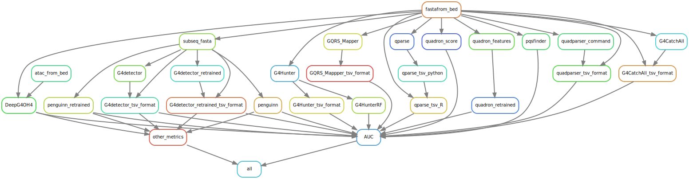

<!-- README.md is generated from README.Rmd. Please edit that file -->

```{r, include = FALSE}
knitr::opts_chunk$set(
  collapse = TRUE,
  comment = "#>",
  fig.path = "figures/README-",
  out.width = "100%"
)
```

## DeepG4ToolsComparison: A snakemake pipeline to run and compare G4 DNA prediction tools with DeepG4

his pipeline generates the results from our paper : [__DeepG4__: A deep learning approach to predict active G-quadruplexes](https://www.biorxiv.org/content/early/2020/07/23/2020.07.22.215699).

### Overview


It's based on [Snakemake](https://snakemake.readthedocs.io/en/stable/) to manage the workflow and [Docker](https://www.docker.com/) to isolate the application and run it with the appropriate tool versions.


### Installation

#### Clone the repository :

```bash
git clone https://github.com/morphos30/DeepG4ToolsComparison.git
cd DeepG4ToolsComparison
```
#### Install the docker image and run it :

```bash
docker build . -t morphos30/g4docker -f Dockerfile/Dockerfile
docker run -it -v /path/To/DeepG4ToolsComparison:/DeepG4ToolsComparison morphos30/g4docker /bin/bash
```

#### Launch the pipeline :

```bash
cd /DeepG4ToolsComparison
snakemake --use-conda -j 30
```

ou have to set the option `--use-conda` in order to install and run each tool in its proper environment.

### Workflow specifications

#### Input

DNA sequences into fasta format, split into positive set and negative set, written into the fasta directory.

__Note :__ if you want add a new dataset, edit the `Snakefile` file and add the fasta files in the dictionnary `EXPERIMENTS`, without the `.Fa` extension. example :

`TestSet_Peaks_BG4_G4seq_HaCaT_GSE76688_hg19_201b_Ctrl_gkmSVM_0.8_42_Ctrl_gkmSVM.Fa`
`TestSet_Peaks_BG4_G4seq_HaCaT_GSE76688_hg19_201b_Ctrl_gkmSVM_0.8_42.Fa`

```python
EXPERIMENTS = {
  "TestSet_Peaks_BG4_G4seq_HaCaT_GSE76688_hg19_201b_Ctrl_gkmSVM_0.8_42_Ctrl_gkmSVM":{"CTRL":"TestSet_Peaks_BG4_G4seq_HaCaT_GSE76688_hg19_201b_Ctrl_gkmSVM_0.8_42_Ctrl_gkmSVM","EXP":"TestSet_Peaks_BG4_G4seq_HaCaT_GSE76688_hg19_201b_Ctrl_gkmSVM_0.8_42"}
}
```

Where `CTRL` is the negative set and `EXP` is the positive set.

#### Rulegraph :

```{r, echo=FALSE, out.width="150%", fig.cap=""}

```

#### Workflow output for each tools :

```{r define, echo=F, message=FALSE, warning=FALSE}
require(tidyverse)
require(kableExtra)
datatools <- tibble(
  "Outputs" = c("DeepG4_BG4G4seq",
"DeepG4_G4seqpmBG4",
"DeepG4_qG4G4seq",
"DeepG4Scan_BG4G4seq",
"DeepG4Scan_G4seqpmBG4",
"DeepG4Scan_qG4G4seq",
"penguinn_retrained",
"penguinn",
"G4detector_retrained",
"G4detector",
"quadron_retrained",
"quadron_score",

"G4CatchAll_max",
"G4CatchAll_mean",
"G4CatchAll_sum",

"G4hunter_max",
"G4hunter_mean",
"G4hunter_sum",
"G4hunterRF",


"qparse_max",
"qparse_mean",
"qparse_sum",
"quadparser_max",
"quadparser_mean",
"quadparser_sum",
"gqrs_mapper_max",
"gqrs_mapper_mean",
"gqrs_mapper_sum",

"pqsfinder"),
"Tools" = str_remove(str_extract(Outputs,".+_|.+"),"_"),
"Methods"=c("DeepG4 using default model",
            "DeepG4 using custom model trained on __G4seqpmBG4__ dataset",
            "DeepG4 using custom model trained on __qG4G4seq__ dataset",
            "DeepG4Scan using default model",
            "DeepG4Scan using custom model trained on __G4seqpmBG4__ dataset",
            "DeepG4Scan using custom model trained on __qG4G4seq__ dataset",
            "penguinn using custom model trained on __BG4G4seq__ dataset",
            "penguinn using default model",
            "G4detector using custom model trained on __BG4G4seq__ dataset",
            "G4detector using default model",
            "quadron using custom model trained on __BG4G4seq__ dataset",
            "quadron using default model",
            
            "G4CatchAll max score is calculated on each sequence",
            "G4CatchAll mean score is calculated on each sequence",
            "G4CatchAll sum score is calculated on each sequence",
            
            "G4hunter max score is calculated on each sequence",
            "G4hunter mean score is calculated on each sequence",
            "G4hunter sum score is calculated on each sequence",
            
            "G4Hunter implemented within a Random Forest",
            
            "qparse max score is calculated on each sequence",
            "qparse mean score is calculated on each sequence",
            "qparse sum score is calculated on each sequence",
            "quadparser max score is calculated on each sequence",
            "quadparser mean score is calculated on each sequence",
            "quadparser sum score is calculated on each sequence",
            "gqrs_mapper max score is calculated on each sequence",
            "gqrs_mapper mean score is calculated on each sequence",
            "gqrs_mapper sum score is calculated on each sequence",
            "default pqsfinder score calculated on each sequence"
            )
)

```

```{r show1,echo=F}
datatools %>% kable(caption = "",format="markdown",escape=F) 
```

Notes: 

* __BG4G4seq__: `Peaks_BG4_G4seq_HaCaT_GSE76688_hg19_201b_Ctrl_gkmSVM.Fa`,`Peaks_BG4_G4seq_HaCaT_GSE76688_hg19_201b.Fa`
* __G4seqpmBG4__: `Peaks_G4seqpm_BG4_HaCaT_GSE76688_hg19_201b_Ctrl_gkmSVM.Fa`, `Peaks_G4seqpm_BG4_HaCaT_GSE76688_hg19_201b.Fa`
* __qG4G4seq__: `Peaks_qG4_G4seq_breastCancer_qG4-ChIP-seq-of-breast-cancer-PDTX_hg19_201b_Ctrl_gkmSVM_Ctrl_gkmSVM.Fa`  `Peaks_qG4_G4seq_breastCancer_qG4-ChIP-seq-of-breast-cancer-PDTX_hg19_201b_Ctrl_gkmSVM.Fa`


### Main result

```{r boxplot1, echo=TRUE, fig.height=12, fig.width=16,dev="png",dpi=150,echo=F,warning=F,message=F}
require(ggplot2)
#peaks BG4G4seq
fres <- read_tsv("results/recap_AUC_4.tsv")
cc <- fres %>% filter(TypeExp %in% c("TestSet_Peaks_BG4_G4seq","Peaks_BG4_G4seq","Peaks_qG4")) %>% 
  unite(Files,TypeExp,Exp,cell_line,Ctrl) %>%
  mutate(Files = factor(Files,levels = rev(c("TestSet_Peaks_BG4_G4seq_GSE76688_HaCaT_Ctrl_gkmSVM",
                                         "Peaks_BG4_G4seq_GSE99205_HaCaT_Ctrl_gkmSVM",
                                         "Peaks_BG4_G4seq_GSE76688_HEKnp_Ctrl_gkmSVM",
                                         "Peaks_BG4_G4seq_GSE107690_K562_Ctrl_gkmSVM",
                                         "Peaks_qG4_breast-cancer-PDTX_qG4_Ctrl_gkmSVM")))) %>% 
  filter(!Tool %in% c("qparse_mean","qparse_max","quadparser_mean","quadparser_sum","DeepG4_G4seqpmBG4","DeepG4_qG4G4seq","G4hunter_max","G4hunter_mean","G4CatchAll_max","G4CatchAll_mean","gqrs_mapper_max","gqrs_mapper_sum")) %>%
  filter(!str_detect(Tool,"DeepG4Scan")) %>%
  group_by(Files) %>% 
  arrange(desc(AUC)) %>% mutate(Classement = 1:dplyr::n()) %>% 
  ungroup() %>% 
  mutate(my_text = str_c(Classement," (",round(AUC,3),")"))
cctext <- cc %>% group_by(Tool) %>% summarise(meanscore = mean(AUC),AUC = sum(AUC))


cc%>% 
  mutate(Files =as.factor(Files)) %>% 
  ggplot(aes(x=fct_reorder(Tool,AUC,mean),y=AUC,fill=Files)) +
  geom_bar(alpha=0.25,stat="identity",col="black") +
  theme_classic(base_size=22) +
  theme(legend.text=element_text(size=20),
        legend.direction = "vertical",
        legend.box = "horizontal",
        # legend.position = c(1,0.025),
        legend.position = "bottom",
        axis.title.y = element_blank(),
        axis.ticks.x = element_blank(),
        axis.text.x = element_blank(),
        legend.justification = c(0, 0)) +
  coord_flip() +
  geom_text(aes(label=my_text),size=6, position=position_stack(0.45)) +
  scale_size_manual(values= c(4,4.8))+
  ylab("sum(AUC)") + xlab("Tools") +ylim(c(0,5)) +
  geom_label(data=cctext,aes(x=Tool,y=AUC,label = round(meanscore,3)),fill="white",position = position_dodge(width = 1),hjust = -0.1,size=5) +
  scale_fill_brewer(palette = "Set1")-> p4
print(p4)

#OLD FIG
# cc <- fres %>% filter(TypeExp %in% c("TestSet_Peaks_BG4_G4seq","Peaks_BG4_G4seq","TestSet_Peaks_qG4","TestSet_Peaks_G4seqpm_BG4")) %>% 
#   unite(Files,TypeExp,Exp,cell_line,Ctrl) %>%
#   group_by(Files) %>% 
#   arrange(desc(AUC)) %>% mutate(Classement = 1:dplyr::n()) %>% 
#   ungroup() %>% 
#   mutate(my_text = str_c(Classement," (",round(AUC,3),")")) %>% 
#   mutate(Tool = fct_reorder(Tool,AUC,mean))
# cctext <- cc %>% group_by(Tool) %>% summarise(meanscore = mean(AUC),AUC = sum(AUC))
# 
# cc%>% 
#   mutate(Files =as.factor(Files)) %>% 
#   ggplot(aes(x=fct_reorder(Tool,AUC,mean),y=AUC,fill=Files)) +
#   geom_bar(alpha=0.25,stat="identity",col="black") +
#   theme_classic(base_size=22) +
#   theme(legend.text=element_text(size=20),
#         legend.direction = "vertical",
#         legend.box = "horizontal",
#         # legend.position = c(1,0.025),
#         legend.position = "bottom",
#         axis.title.y = element_blank(),
#         axis.ticks.x = element_blank(),
#         axis.text.x = element_blank(),
#         legend.justification = c(0, 0)) +
#   coord_flip() +
#   geom_text(aes(label=my_text), position=position_stack(0.45), size=4) +
#   ylab("sum(AUC)") + xlab("Tools") +ylim(c(0,6)) +
#   geom_label(data=cctext,aes(x=Tool,y=AUC,label = round(meanscore,3)),fill="white",position = position_dodge(width = 1),hjust = -0.1,size=5) +
#   scale_fill_brewer(palette = "Set1") + ggtitle("AUC on (BG4|qG4)-G4Seq datasets")-> p4
# print(p4)

```
