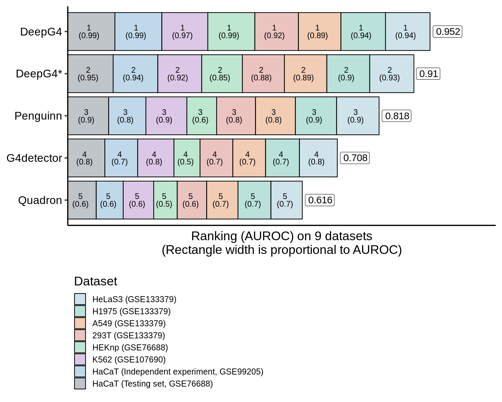

<!-- README.md is generated from README.Rmd. Please edit that file -->

## DeepG4ToolsComparison: A snakemake pipeline to run and compare G4 DNA prediction tools with DeepG4

This pipeline generates the results from our paper : [**DeepG4**: A deep
learning approach to predict active
G-quadruplexes](https://www.biorxiv.org/content/early/2020/07/23/2020.07.22.215699).

### Overview

It’s based on [Snakemake](https://snakemake.readthedocs.io/en/stable/)
to manage the workflow and [Docker](https://www.docker.com/) to isolate
the application and run it with the appropriate tool versions.

### Installation

#### Clone the repository :

``` bash
git clone https://github.com/morphos30/DeepG4ToolsComparison.git
cd DeepG4ToolsComparison
```

#### Install the docker image and run it :

``` bash
docker build . -t morphos30/g4docker -f Dockerfile/Dockerfile
docker run -it -v /path/To/DeepG4ToolsComparison:/DeepG4ToolsComparison morphos30/g4docker /bin/bash
```

#### Launch the pipeline :

``` bash
cd /DeepG4ToolsComparison
snakemake --use-conda -j 30
```

you have to set the option `--use-conda` in order to install and run each
tool in its proper environment.

### Workflow specifications

#### Input

DNA sequences into fasta format, split into positive set and negative
set, written into the fasta directory.

**Note :** if you want add a new dataset, edit the `Snakefile` file and
add the fasta files in the dictionnary `EXPERIMENTS`, without the `.Fa`
extension. example :

`TestSet_Peaks_BG4_G4seq_HaCaT_GSE76688_hg19_201b_Ctrl_gkmSVM_0.8_42_Ctrl_gkmSVM.Fa`
`TestSet_Peaks_BG4_G4seq_HaCaT_GSE76688_hg19_201b_Ctrl_gkmSVM_0.8_42.Fa`

``` python
EXPERIMENTS = {
  "TestSet_Peaks_BG4_G4seq_HaCaT_GSE76688_hg19_201b_Ctrl_gkmSVM_0.8_42_Ctrl_gkmSVM":{"CTRL":"TestSet_Peaks_BG4_G4seq_HaCaT_GSE76688_hg19_201b_Ctrl_gkmSVM_0.8_42_Ctrl_gkmSVM","EXP":"TestSet_Peaks_BG4_G4seq_HaCaT_GSE76688_hg19_201b_Ctrl_gkmSVM_0.8_42"}
}
```

Where `CTRL` is the negative set and `EXP` is the positive set.

#### Rulegraph :


#### Workflow output for each tools :

| Outputs                | Tools        | Methods                                                         |
| :--------------------- | :----------- | :-------------------------------------------------------------- |
| DeepG4\_BG4G4seq       | DeepG4       | DeepG4 using default model                                      |
| DeepG4\_G4seqpmBG4     | DeepG4       | DeepG4 using custom model trained on **G4seqpmBG4** dataset     |
| DeepG4\_qG4G4seq       | DeepG4       | DeepG4 using custom model trained on **qG4G4seq** dataset       |
| DeepG4Scan\_BG4G4seq   | DeepG4Scan   | DeepG4Scan using default model                                  |
| DeepG4Scan\_G4seqpmBG4 | DeepG4Scan   | DeepG4Scan using custom model trained on **G4seqpmBG4** dataset |
| DeepG4Scan\_qG4G4seq   | DeepG4Scan   | DeepG4Scan using custom model trained on **qG4G4seq** dataset   |
| penguinn\_retrained    | penguinn     | penguinn using custom model trained on **BG4G4seq** dataset     |
| penguinn               | penguinn     | penguinn using default model                                    |
| G4detector\_retrained  | G4detector   | G4detector using custom model trained on **BG4G4seq** dataset   |
| G4detector             | G4detector   | G4detector using default model                                  |
| quadron\_retrained     | quadron      | quadron using custom model trained on **BG4G4seq** dataset      |
| quadron\_score         | quadron      | quadron using default model                                     |
| G4CatchAll\_max        | G4CatchAll   | G4CatchAll max score is calculated on each sequence             |
| G4CatchAll\_mean       | G4CatchAll   | G4CatchAll mean score is calculated on each sequence            |
| G4CatchAll\_sum        | G4CatchAll   | G4CatchAll sum score is calculated on each sequence             |
| G4hunter\_max          | G4hunter     | G4hunter max score is calculated on each sequence               |
| G4hunter\_mean         | G4hunter     | G4hunter mean score is calculated on each sequence              |
| G4hunter\_sum          | G4hunter     | G4hunter sum score is calculated on each sequence               |
| G4hunterRF             | G4hunterRF   | G4Hunter implemented within a Random Forest                     |
| qparse\_max            | qparse       | qparse max score is calculated on each sequence                 |
| qparse\_mean           | qparse       | qparse mean score is calculated on each sequence                |
| qparse\_sum            | qparse       | qparse sum score is calculated on each sequence                 |
| quadparser\_max        | quadparser   | quadparser max score is calculated on each sequence             |
| quadparser\_mean       | quadparser   | quadparser mean score is calculated on each sequence            |
| quadparser\_sum        | quadparser   | quadparser sum score is calculated on each sequence             |
| gqrs\_mapper\_max      | gqrsmapper\_ | gqrs\_mapper max score is calculated on each sequence           |
| gqrs\_mapper\_mean     | gqrsmapper\_ | gqrs\_mapper mean score is calculated on each sequence          |
| gqrs\_mapper\_sum      | gqrsmapper\_ | gqrs\_mapper sum score is calculated on each sequence           |
| pqsfinder              | pqsfinder    | default pqsfinder score calculated on each sequence             |

Notes:

  - **BG4G4seq**:
    `Peaks_BG4_G4seq_HaCaT_GSE76688_hg19_201b_Ctrl_gkmSVM.Fa`,`Peaks_BG4_G4seq_HaCaT_GSE76688_hg19_201b.Fa`
  - **G4seqpmBG4**:
    `Peaks_G4seqpm_BG4_HaCaT_GSE76688_hg19_201b_Ctrl_gkmSVM.Fa`,
    `Peaks_G4seqpm_BG4_HaCaT_GSE76688_hg19_201b.Fa`
  - **qG4G4seq**:
    `Peaks_qG4_G4seq_breastCancer_qG4-ChIP-seq-of-breast-cancer-PDTX_hg19_201b_Ctrl_gkmSVM_Ctrl_gkmSVM.Fa`
    `Peaks_qG4_G4seq_breastCancer_qG4-ChIP-seq-of-breast-cancer-PDTX_hg19_201b_Ctrl_gkmSVM.Fa`

### Main result


