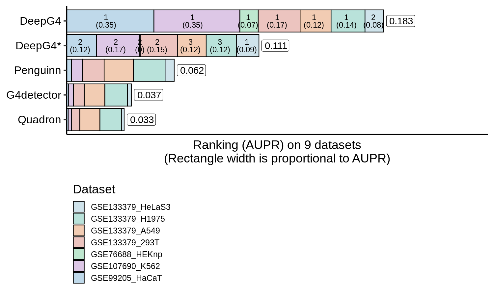
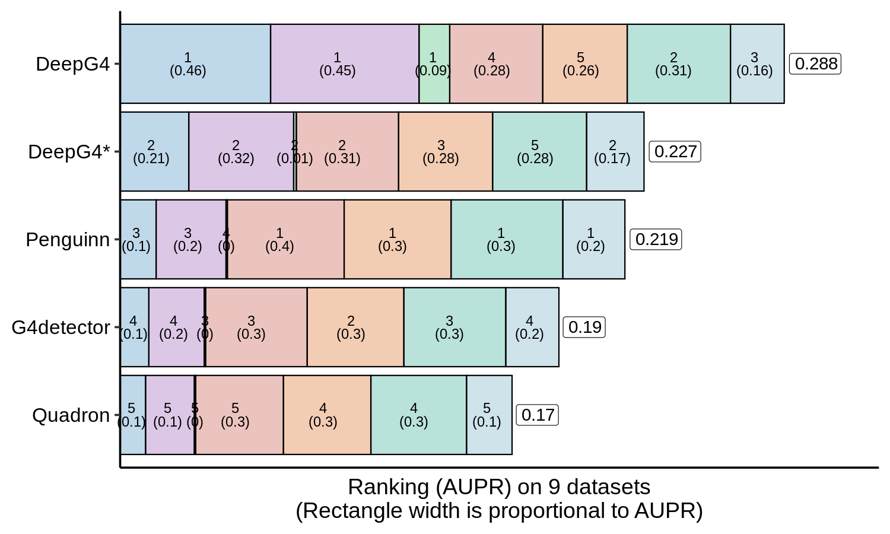
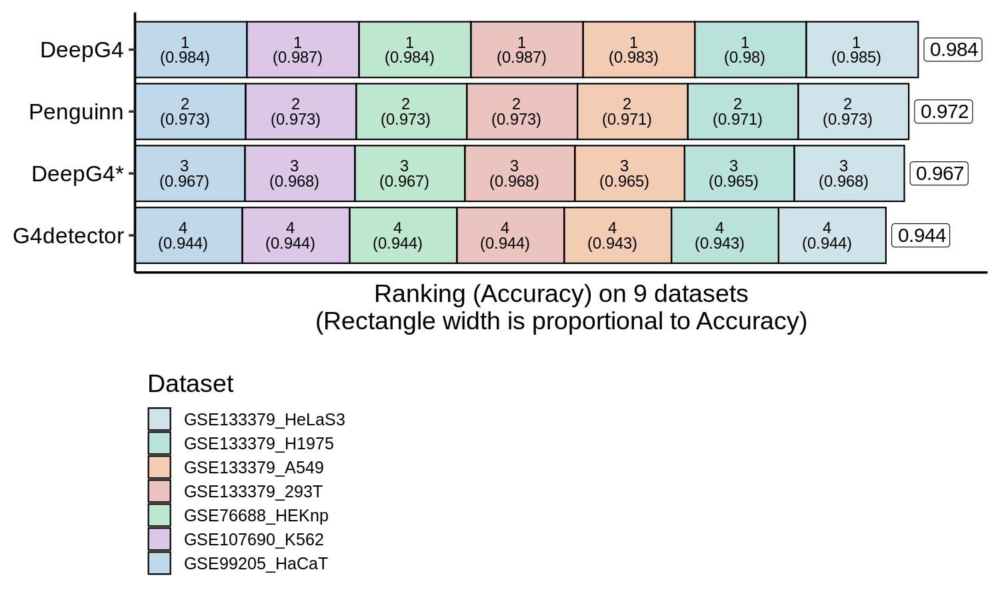
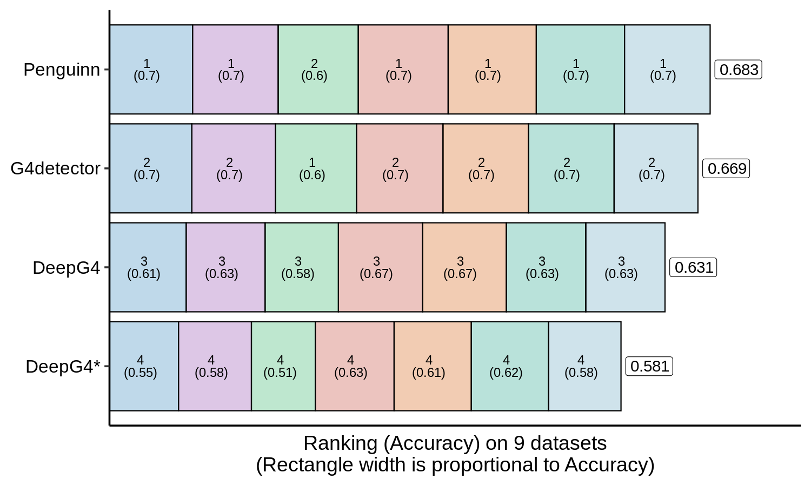
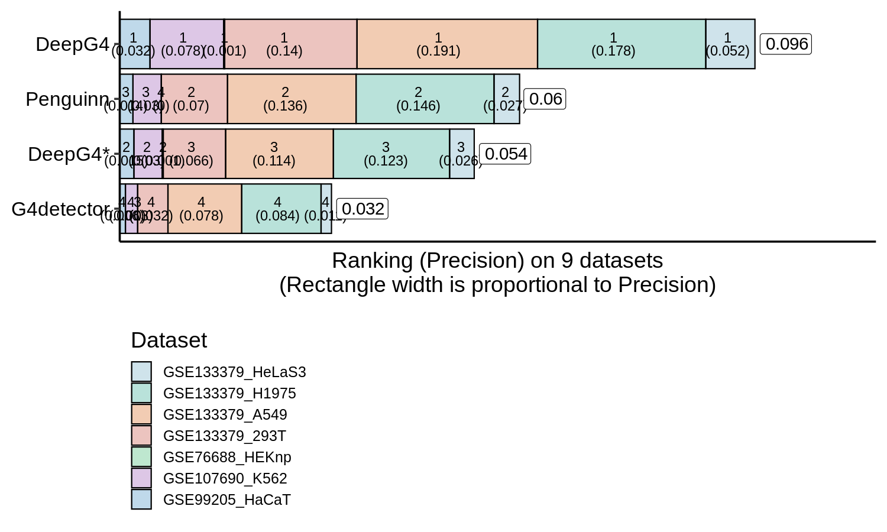
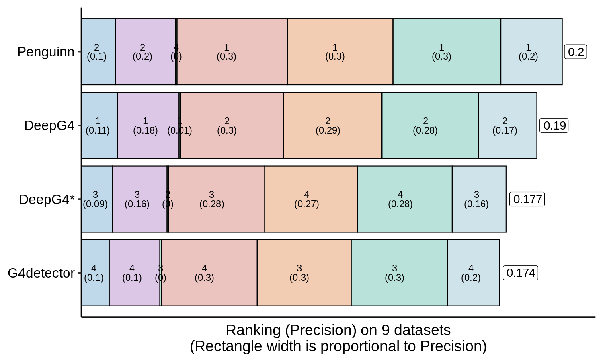
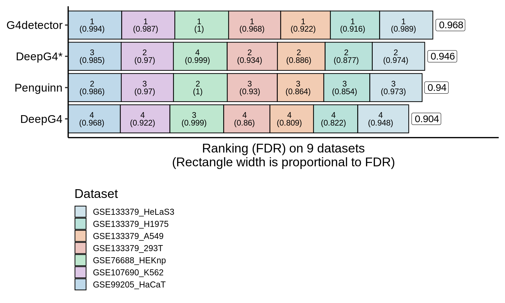
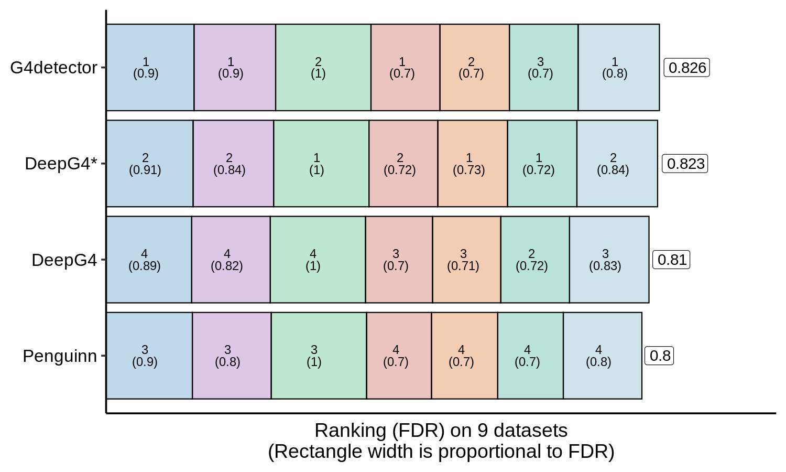

<!-- README.md is generated from README.Rmd. Please edit that file -->

## DeepG4ToolsComparison: A snakemake pipeline to run and compare G4 DNA prediction tools with DeepG4

This pipeline generates the `precision/recall` curves on genome-wide
using `201 bp` bins. It also generate the `precision/recall` curves on
[promoters](bed/Genes_hg19_from_Homo.sapiens.bed).

### Overview

It’s based on [Snakemake](https://snakemake.readthedocs.io/en/stable/)
to manage the workflow and [Docker](https://www.docker.com/) to isolate
the application and run it with the appropriate tool versions.

### Installation

#### Clone the repository :

``` bash
git clone https://github.com/morphos30/DeepG4ToolsComparison.git
cd DeepG4ToolsComparison
```

#### Install the docker image and run it :

``` bash
docker build . -t morphos30/g4docker -f Dockerfile/Dockerfile
docker run -it -v $(pwd):/DeepG4ToolsComparison morphos30/g4docker /bin/bash
```

Where `$(pwd)` is the working directory of `DeepG4ToolsComparison` on
your computer.

#### Launch the pipeline :

``` bash
cd /DeepG4ToolsComparison/prediction_genome
snakemake --use-conda
```

You have to set the option `--use-conda` in order to install and run
each tool in its proper environment.

### Workflow specifications

Unfortunately, bigwig files are too big to be stored on github, so the
user will have to download them in order to launch the pipeline.
Informations to get the files are available in the [bigwig
directory](bigwig/).

#### Input (auPR)

-   DNA sequences into bed format written into the bed directory.

**Note :** if you want add a new dataset, edit the `Snakefile` file and
add the bed files in the dictionnary `EXPERIMENTS`, without the `.bed`
extension. Example :

`TestSet_Peaks_BG4_G4seq_HaCaT_GSE76688_hg19_201b_Ctrl_gkmSVM_0.8_42.bed`

``` python
EXPERIMENTS = {
  "TestSet_Peaks_BG4_G4seq_HaCaT_GSE76688_hg19_201b_Ctrl_gkmSVM_0.8_42_Ctrl_gkmSVM":{"EXP":"TestSet_Peaks_BG4_G4seq_HaCaT_GSE76688_hg19_201b_Ctrl_gkmSVM_0.8_42"}
}
```

Where `CTRL` is the negative set and `EXP` is the positive set.

-   DNA Accessibility (ATAC-seq/DNAse-seq/MNase-seq) in bigwig format,
    stored in the `bigwig` directory.

``` python
ATACFILE = {
    "TestSet_Peaks_BG4_G4seq_HaCaT_GSE76688_hg19_201b_Ctrl_gkmSVM":["ATAC_entinostat_mean"]
}
```

#### Input (Prediction only)

-   DNA Accessibility (ATAC-seq/DNAse-seq/MNase-seq) in bigwig format,
    stored in the `bigwig` directory.

``` python
TISSUES = [
"cerebellum_tissue"
]

ATACFILE = {
    "cerebellum_tissue":["ENCODE/cerebellum_tissue"]
}
```

#### Rulegraph :


### Main result


